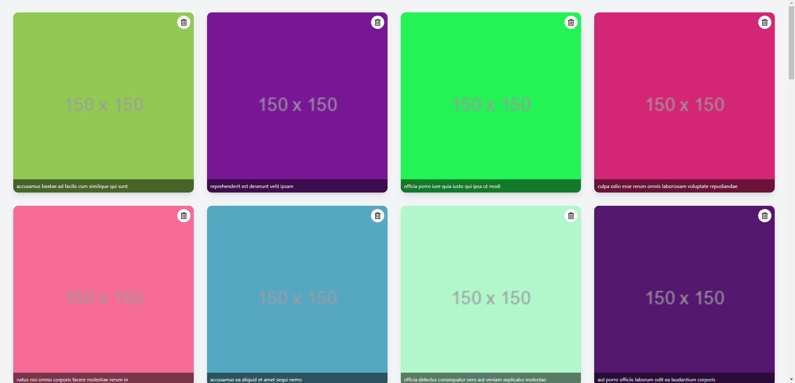

# React + Vite + Tailwind CSS + Jest

Este es un proyecto frontend creado con React y Tailwind CSS que presenta una galería de imágenes con funciones de carga dinámica al hacer scroll y eliminación de imágenes. También incluye pruebas unitarias realizadas con Jest.



## 🚀 Inicializar el proyecto

- Clona el repositorio
- Comprueba que estás en la carpeta 'frontend'

```bash
cd frontend
```

- Instala las dependencias del proyecto

```bash
npm install
```

- Lanza el proyecto en tu local.

```bash
npm run dev
```

Esto abrirá una nueva pestaña en tu navegador con la aplicación.

- Ejecuta los test

```bash
npm test
```

Este comando ejecutará Jest en modo interactivo, permitiéndote ver los resultados de las pruebas y cualquier error que ocurra.

## 🖥️ Tecnologías utilizadas

- React
- Tailwind CSS
- Framer Motion
- Jest

## 🔒 Licencia

Este proyecto está licenciado bajo la Licencia MIT.
